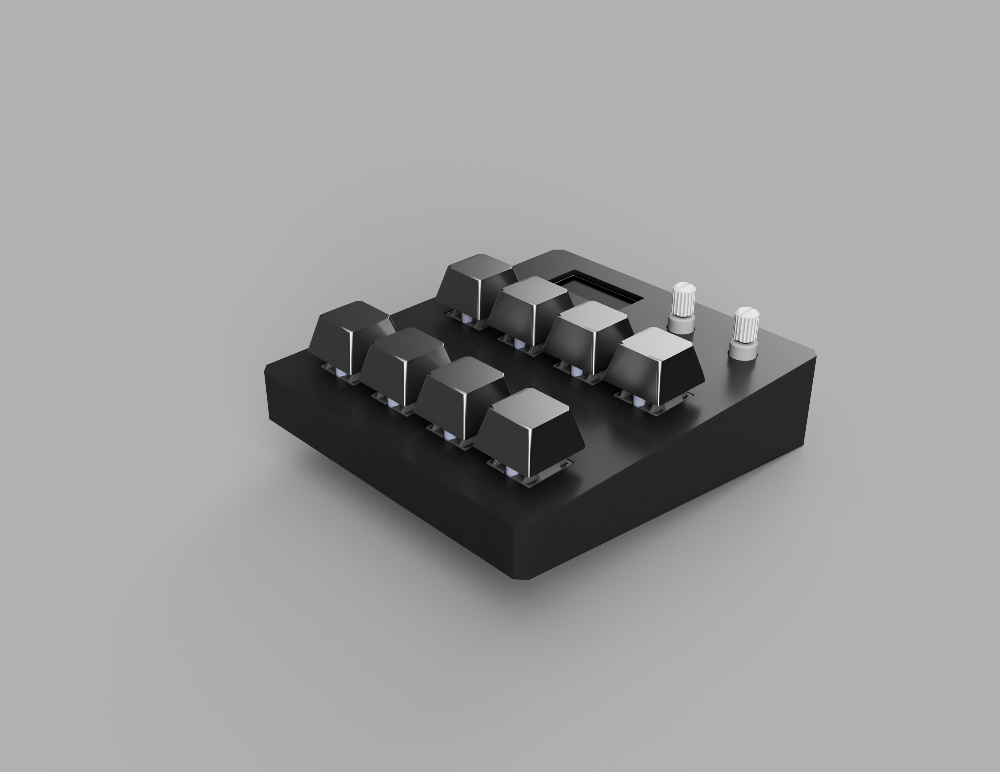
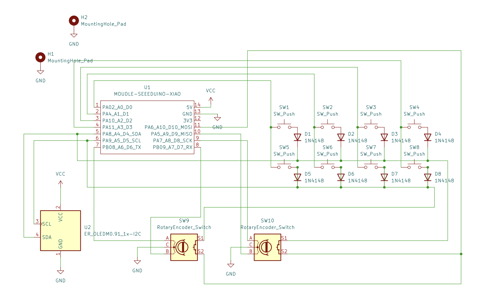

# Ampselector (Guitar Rig 7 centric macropad)

Ampselector is a 8 key + two encoder macropad designed to be used for Guitar Rig 7. For actions such as switching between amps or effects presets.

Built using a RP2040 microcontroller in the form of the SEEED STUDIO XIAO, and powered by custom software built on QMK.

## Features: 
- 4x2 grid array
- Dual EC11 microcontrollers
- OLED Display
- Natively outputs MIDI CC codes, and can be programmed into GR7

## CAD / Assembly
- The PCB is screwed *(M3 screw)* onto the lower case with two screws *(into heatset inserts)*
- The top panel is super glued onto the lower case *(sleeker look)*
- Uses MX style keys and keycaps
- This was designed in Fusion360
- Make sure to flash firmware and have it running before you superglue the case together!

## PCB 
- I would recommend buying a thicker style of 2 layer PCB for this project, for the added durability and rigidity
- This was designed in KiCad 

## BILL OF MATERIALS (BOM)
This project uses:
- 1x Seeed Studio XIAO RP2040
- 8x through hole 1N4148 diodes
- 1x OLED Display (.91in)
- 2x EC11 Rotarary Encoders
- 8x MX Style Keyswitches
- 8x DSA Keycaps
- 2x M3 x 16mm Screws
- 2x M3 Heatset inserts
- 1x PCB (order with gerbers.zip in production)
- 1x Top case (3d print  file in production)
- 1x Bottom case (3d print  file in production)

## Flashing firmware:
- Download the "firmware.uf2" file
- Press and hold the BOOT button on the RP2040 board
- Connect the Data compatible USB cable to the board
- It will appear like a USB drive on your computer, drop the "firmware.uf2" file onto it
- Once it uploads it should disappear as a USB drive, and restart and begin running the QMK firmware!

## Mapping to Guitar Rig 7:
The keyboard will output various MIDI CC codes, which you can map to various functions in GR7. There's some good info on this forum [thread](https://community.native-instruments.com/discussion/46400/guitar-rig-7-switching-presets-live-with-a-midi-foot-controller)
